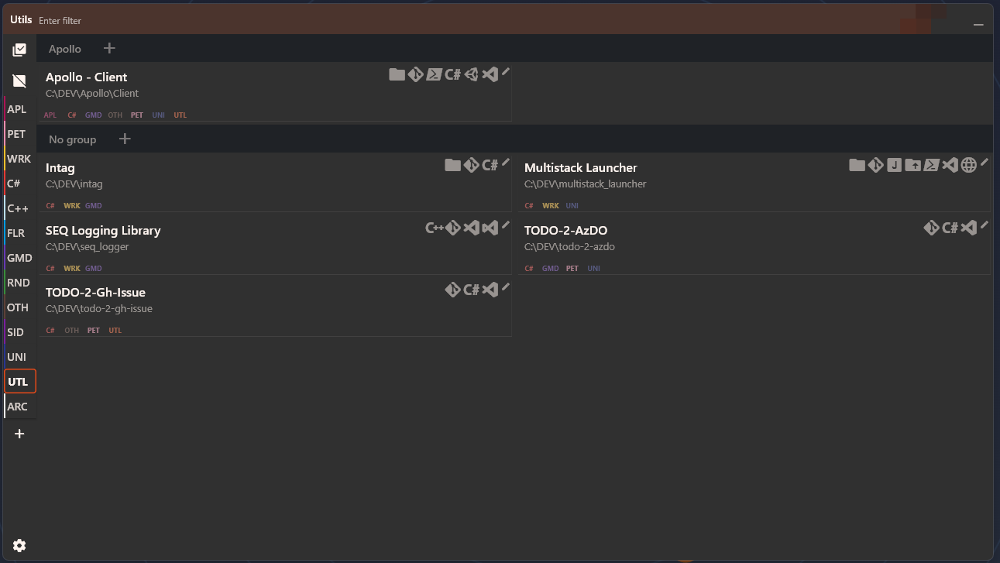

# Multistack Launcher

Small util to show all the projects you need in one place, able to launch what you need with minimum required information at hand.

> **To organize things even better** check out my other tool I've been developing. It's ok and small, just for explorer tagging.
> 
> [InTag GitHub project](https://github.com/Jamminroot/intag)

> **SUGGESTIONS ARE WELOME, SO ARE DONATIONS**, as they both boost my motivation to improve those tools :+1:

> __NOTE__
Be aware that this tool was initially made just for myself, and, since I'm just a flutter hobbyist, CodeStyle, design choices and stuff like that might be lacking.

## Features

- __Launch any tool you need directly from the main screen__
- __Multiple stack variants support__
- __Stacks can be bound to specific tags__
- __Quick git fetch button__
- __Shows uncommitted changes__
- __Quick filtering__
- __Hotkey support__
- __No taskbar icon when hidden__
- __Background refresh__ 
- __Show git commits ahead\behind__
- __Quick fast-forward pull__
- __Show stargazers\Issues\PRs open badges__
- __Branch name on card__
- __Subtle animations here and there__ :smile:

> __NOTE__
> Using Git features requires project directory to be a git repo.

> __NOTE__
> While public repos would work without it, using GitHub features requires GitHub PAT assigned in settings - as the rate limits are not as poor when with PAT specified.

---
### UI Layout

---
### Tray icon 

---
### Card layout

1. Project name
2. Uncommitted status
3. Project path
4. Project tags
5. Assigned stacks
6. Git branch
7. Stargazers\Issues\PRs badges
8. Refresh git + git fetch
9. Edit project

---
### Launch any tool you need directly from the main screen

All the stack buttons are at hand - just launch what you need from one place, no more need to:
1) Launch IDE
1) Select project in IDE launcher
1) Launch powershell
1) Navigate to project path
1) Launch custom tool (say, port forwarding or something like that)
1) Launch browser (or open a tab, but still)

Instead, just click a bunch of buttons on the needed card (_#5 on card layout_)

> __NOTE__
To specify a parameter use double-curly braces in command or args. Default parameter `{{path}}` evaluates to project path and the parameter name `path` is reserved, so think of a different name whether you need one. 

---
### Multiple stack variants support

Some projects might have various solutions\paths\utils to execute. With variants one would be able to specify different launch variants.

> __NOTE__
Names can only be edited if more than one variant assigned. To add a variant click "+" next to stack name in a project settings dialog.

---
### Stacks can be bound to specific tags

Some tools are only to be used for specific areas, right? You don't need to see Visual Studio if you are using WebStorm for JS project. I got you covered here! Just specify a tag for a stack, and that's it. You will only see stack without tags bound and stacks of tags assigned to project.

> __NOTE__
If no tags assigned to the stack, the stack would be available for all projects. 

---
### Quick git fetch button

Sometimes you need to check manually. There's an update button for that (_#8 on card layout_).

---
## Shows uncommitted changes

If program detects that some changes made, but not yet committed, you'll see `edited` message next to project name (_#2 on card layout_).

---
## Quick filtering

Just start typing anywhere in the window, program will know what to do with. 

### Hotkey support

Win+~ to show\hide. That's it.

---
### No taskbar icon when hidden

I thought that having less clutter on taskbar is good, so I've added it.

---
### Background refresh

To avoid manually updating everything, program will update status on its own in background.

> __NOTE__
One minute for foreground, 10 minutes for background. Editing those values (or disabling checks entirely) are in plans.

---
### Show git commits ahead\behind

If there are commits not pushed, or something to pull - you'll see arrows and numbers next to branch name.

---
### Quick fast-forward pull

If it's possible to just pull changes, you'll see the cloud icon in git part of the card.

---
### Show stargazers\Issues\PRs open badges

You'll see if there's something happened on the remote :smile: (_#7 on card layout_).

---
### Branch name on card

Active branch shows on card. Plain and informative (_#6 on card layout_).

---
### Subtle animations here and there

You'll notice slight animations, tints and stuff like that. 
> It ain't much, but it's honest work. :smile:

## A bit more screenshots

### Other

PRs are highly appreciated, especially since I'm not really a front-end developer, and not really working with flutter but rather just a hobbyist.
